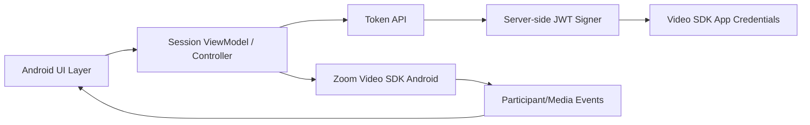

# Android Architecture Concept

## Design guidance

- Keep token creation strictly backend-side.
- Keep SDK calls in a session controller or ViewModel boundary.
- Drive UI from SDK event streams to avoid stale participant state.
- Treat join/start-media/leave as explicit state transitions.
