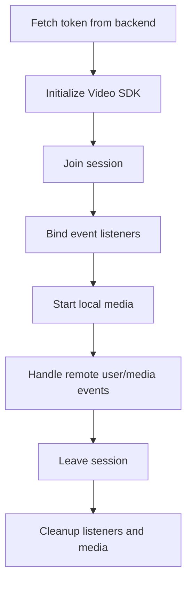

# Android Lifecycle Workflow

## Operational sequence

1. Request token from backend using app auth context.
2. Initialize SDK and register core listeners.
3. Join session with session name/topic, display name, and token.
4. Start local camera/mic only after successful join.
5. Render remote users when events indicate media state changes.
6. On leave/disconnect, unsubscribe listeners and release resources.
