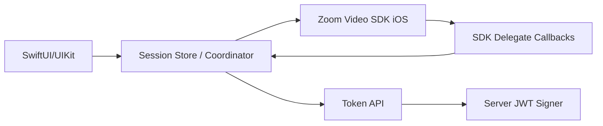

# iOS Architecture Concept

## Design guidance

- Use a coordinator/store layer to isolate SDK-specific logic.
- Keep join/start/leave actions explicit and serial.
- Render participant tiles from delegate-driven state only.
