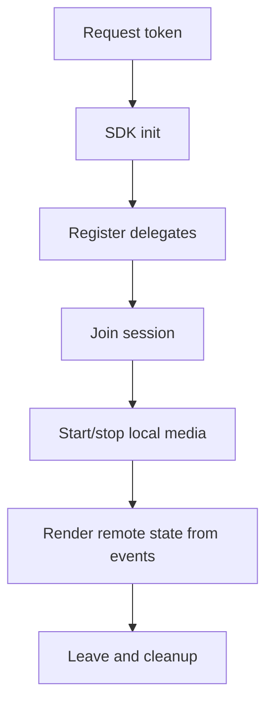

# iOS Lifecycle Workflow

## Operational sequence

1. Request token from backend.
2. Initialize Video SDK and attach delegates.
3. Join session with session name/topic and display name.
4. Start local media after join success callback.
5. Handle participant and media callbacks as the source of truth.
6. Cleanup delegates and session resources on exit.
