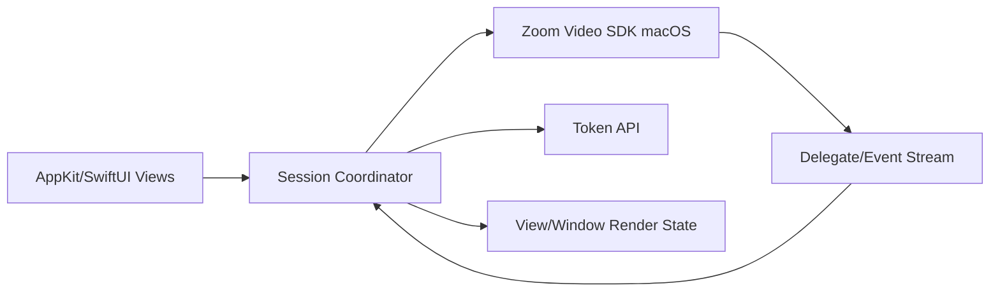

# macOS Architecture Concept

## Design guidance

- Centralize SDK access in a coordinator/service boundary.
- Separate render state from transport/session state.
- Treat join, share, and leave as explicit transitions.
