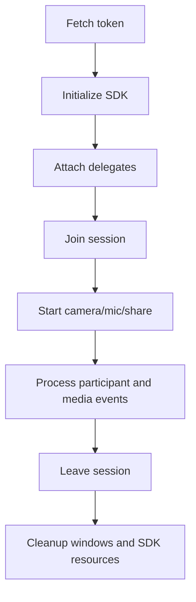

# macOS Lifecycle Workflow

## Operational sequence

1. Request token from backend.
2. Initialize SDK and delegate/event bridge.
3. Join session with user identity.
4. Start media after join confirmation.
5. Handle remote participant/media updates and view lifecycle.
6. Stop media and release resources on leave.
