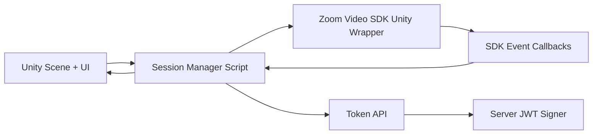

# Unity Architecture Concept

## Design guidance

- Keep wrapper calls behind one Session Manager abstraction.
- Convert SDK callbacks into explicit Unity state updates.
- Avoid direct credential logic in Unity client.
