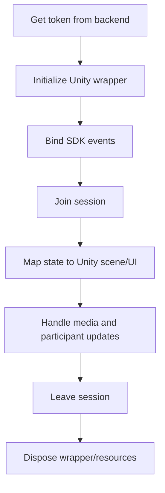

# Unity Lifecycle Workflow

## Operational sequence

1. Request token from backend.
2. Initialize SDK wrapper and event handlers.
3. Join session with topic/session name and display identity.
4. Start/stop local media via wrapper APIs.
5. Apply participant/media updates to Unity scene objects.
6. Cleanly dispose resources on leave or scene switch.
